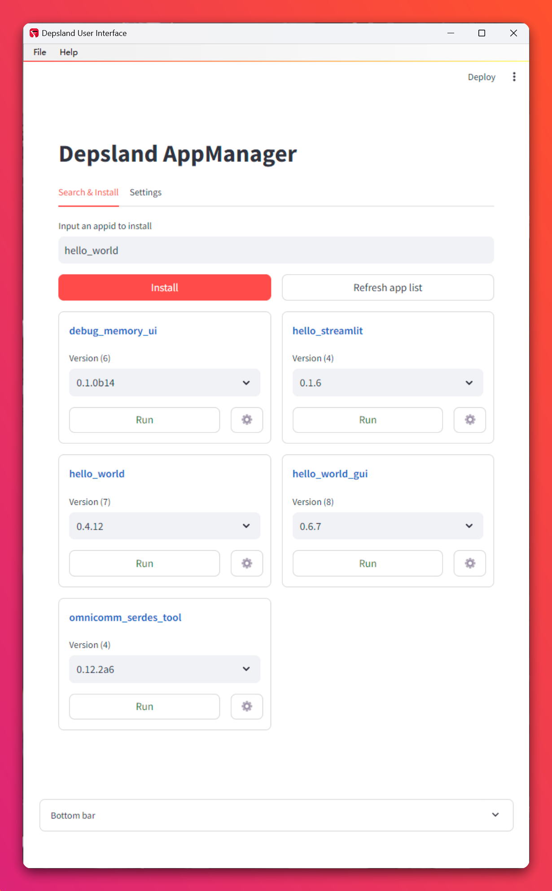

# Depsland

Depsland is a tool for user with non-developing experience to install, launch, upgrade and share Python applications in a portable way.

---

## User Guide

### Installation

Download the latest release from *TODO*

### Get Started

Unzip, then double click "Depsland.exe" to start the GUI.



...

---

## Developer Guide

### Installation

```sh
pip install depsland
```

### Get Started

```sh
# get help
py -m depsland -h

# launch gui
py -m depsland launch-gui
```


### Distribute Your Application

> *WARNING: UNDER CONSTURCTION*

Assume you have a Python project:

```
my-hello-world-app
|- data
|- src
|  |- main.py
|- pyproject.toml
|- poetry.lock
```

First run `depsland init` to create a `manifest.json` file:

```sh
py -m depsland init /the/path/to/my-hello-world-app
```

Then edit the `manifest.json` file:

```json
{
    "appid": "hello_world",
    "name": "Hello World",
    "version": "1.0.0",
    "assets": {
        "data": "all",
        "src": "all"
    },
    "dependencies": "pyproject.toml",
    "launcher": {
        "target": "src/main.py",
        "type": "module",
        "icon": "",
        "args": [],
        "kwargs": {},
        "enable_cli": true,
        "add_to_desktop": true,
        "add_to_start_menu": false,
        "show_console": true
    },
    "depsland_version": "0.7.0"
}
```

Finally publish:

```sh
py -m depsland publish /the/path/to/my-hello-world-app
```

Once published, users can type "hello_world" in searchbox on the UI to install and launch your application.
