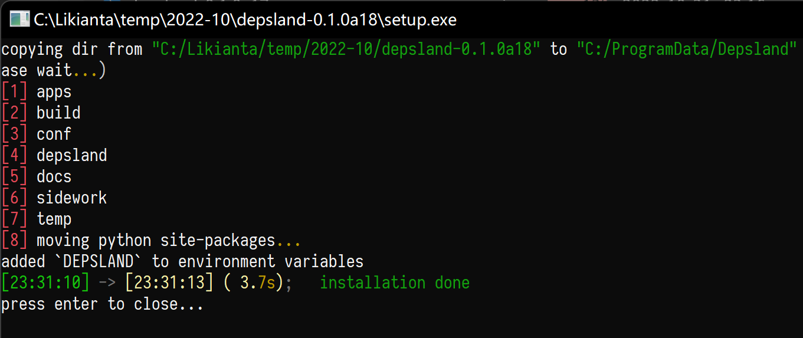
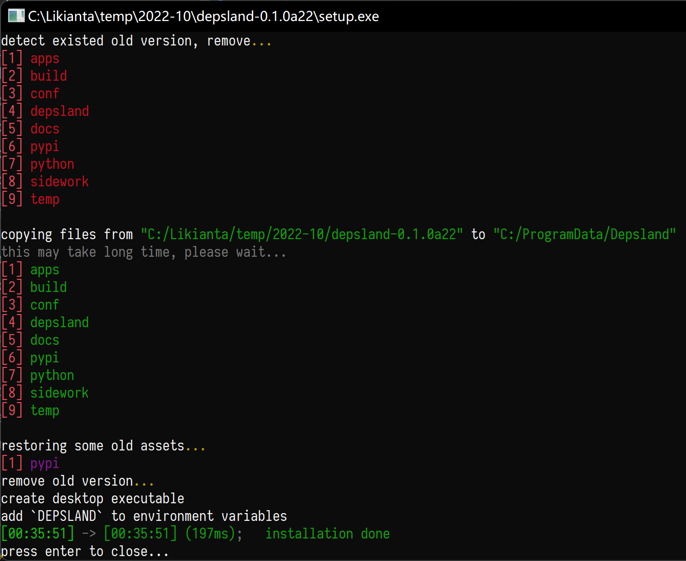
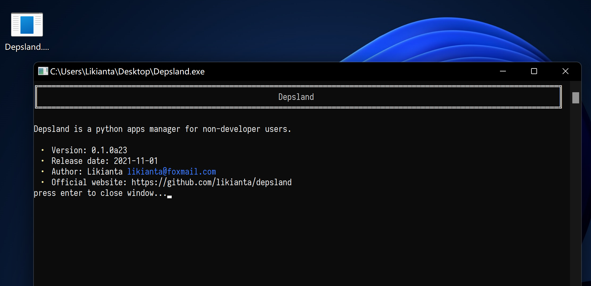

# 构建说明

## 准备文件

1. 生成 exe 文件

    如果本目录下缺少以下文件:

    - exe/\*.exe

    则需要通过同名的 bat 文件来生成:

    1. 找一个 windows 系统的电脑
    2. 终端命令:

        ```sh
        py build/build.py bat-2-exe build/exe/depsland.bat
        py build/build.py bat-2-exe build/exe/desktop.bat
        py build/build.py bat-2-exe build/exe/setup.bat
        py build/build.py bat-2-exe build/exe/setup_patch.bat
        ```

## 生成 depsland 安装包

1. 检查 `depslan/__init__.py` 的版本号 (`__version__`) 是否需要更新

    请注意, 该版本号必须不存在于 dist 目录下 (例如, 如果当前是 0.1.0 版本, 在 dist 目录下不可以有 "depsland-setup-0.1.0" 目录).

    如果有的话, 要么手动删除该目录, 要么更新一下版本号.

2. 终端命令:

    ```sh
    # 整个过程很快, 在 1s 左右完成.
    py build/build.py full-build aliyun
    ```

3. 生成结果: `dist/depsland-setup-<version>` (文件夹)

    该文件夹的体积在 140mb 左右 (压缩后约 55mb). 各部分占比如下:

    - depsland 源代码: 190kb (0.13%)
    - python 解释器: 90mb (64.29%)
    - depsland 依赖库: 50mb (35.71%)
    - 其他文件: 120kb (0.08%)

## 用户安装

1. 用户收到该安装包 (体积约 55mb)
2. 解压到任意目录 (推荐英文路径)
3. 运行 setup.exe

    截图:

    
    
    

4. 测试是否安装成功:

     1. 确认桌面上出现了 "Depsland.exe" 的启动器
     2. 双击该启动器, 看是否会出现欢迎界面

         

## 常用命令备忘

self_build.py

```sh
py build/self_build.py -h

py build/self_build.py init pypi
py build/self_build.py init pypi_self

py build/self_build.py build
py build/self_build.py build -sd
py build/self_build.py build -sd -si

py build/self_build.py link
```

build.py

```sh
py build/build.py -h
py build/build.py full-build -h

py build/build.py full-build aliyun
py build/build.py full-build aliyun -p full
py build/build.py full-build aliyun -p least

py build/build.py bat-2-exe build/exe/depsland.bat
py build/build.py bat-2-exe build/exe/desktop.bat -u
py build/build.py bat-2-exe build/exe/setup.bat -C -u
```

unittests

```sh
py -m depsland publish unittests/demo_apps/hello-world/manifest.json
py -m depsland publish unittests/demo_apps/hello-world-gui/manifest.json
```
