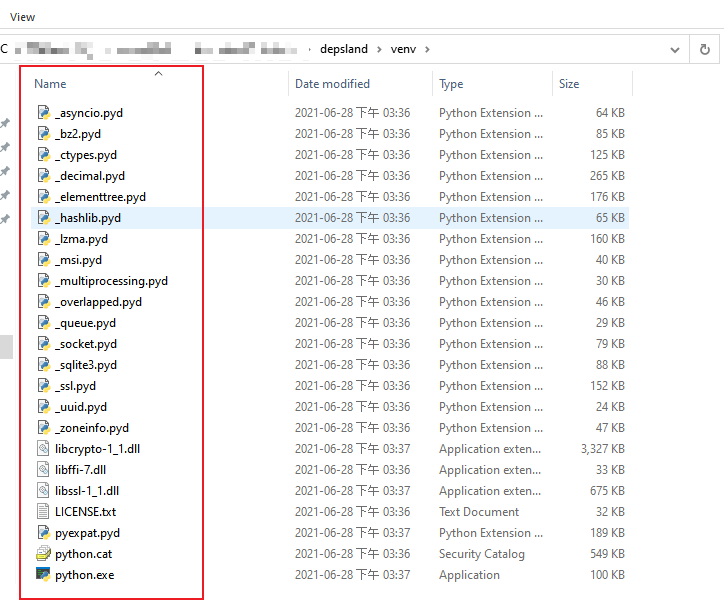
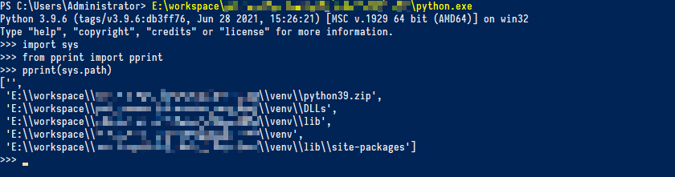

# 在嵌入式 Python 中安装 pip

为了保证打包后的 Depsland 能够直接复用自己的虚拟环境, 我们没有通过系统 Python 创
建 venv 环境, 而是改由手动下载嵌入式 Python 以及其他方式安装 pip 来达到目的.

下面是详细的动手过程:

*注: 下文提到的所有波浪符请自行替换为自己电脑上的实际路径.*

# 安装嵌入式 Python

1. 下载 embed python 3.9: [python-3.9.6-embed-amd64.zip](https://npm.taobao.org/mirrors/python/3.9.6/python-3.9.6-embed-amd64.zip)

2. 解压到 '~/depsland/venv'

    

3. 在 '~/depsland/venv' 下创建以下空目录

    *注: 大小写不敏感.*

    ```
    depsland/venv
    |= dlls
    |= lib
        |= site-packages
    |= scripts
    ```

4. 将 'python39._pth' 文件删除 (或者将它重命名为 'python39._pth.bak')

    *注: 该操作将改变 embed python 的 `sys.path` 的值, 更符合我们的使用习惯.*

5. 在 cmd 中测试:

    ```
    ~/depsland/venv/python.exe
    >>> # 现在我们进入了 embed python 的交互控制台
    >>> import sys
    >>> # 打印 sys.path
    >>> print(sys.path)
    >>> # 退出交互模式
    >>> sys.exit()
    ```

    截图:

    

# 安装 pip

1. 首先下载 setuptools (待会儿我们安装 pip 时需要用到): [setuptools-57.4.0-py3-none-any.whl](https://pypi.tuna.tsinghua.edu.cn/packages/bd/25/5bdf7f1adeebd4e3fa76b2e2f045ae53ee208e40a4231ad0f0c3007e4353/setuptools-57.4.0-py3-none-any.whl#sha256=a49230977aa6cfb9d933614d2f7b79036e9945c4cdd7583163f4e920b83418d6)

2. 将下载后的文件的后缀改为 '.zip', 然后解压
    
    解压得到以下文件夹:

    ```
    downloads
    |= setuptools-57.4.0-py3-none-any
        |= _distutils_hack
        |= pkg_resources
        |= setuptools
        |= setuptools-57.4.0.dist-info
        |- distutils-precedence.pth
    ```

3. 将这些解压后的文件夹复制到 '~/depsland/venv/lib/site-packages' 下面

    *注: distutils-precedence.pth 可以不复制, 不影响效果.*

4. 下载 pip 的源码包: [pip-21.2.4.tar.gz](https://pypi.tuna.tsinghua.edu.cn/packages/52/e1/06c018197d8151383f66ebf6979d951995cf495629fc54149491f5d157d0/pip-21.2.4.tar.gz#sha256=0eb8a1516c3d138ae8689c0c1a60fde7143310832f9dc77e11d8a4bc62de193b)

    解压, 得到以下文件:

    ```
    downloads
    |= pip-21.2.4       : 解压位置随意
        |= pip-21.2.4
            |- setup.py : 这个文件是重点
            |- ... 
        |- @PaxHeader
    ```

5. 打开 cmd

6. cd 到 pip 的解压目录下: `cd ~/downloads/pip-21.2.4/pip-21.2.4`

7. 执行安装: `~/depsland/venv/python.exe setup.py install`

8. 在 '~/depsland/venv' 下会出现以下文件:

    ```
    depsland/venv
    |= dlls
    |= lib
        |= site-packages
            |= pip-21.2.4-py3.9.egg
            |- easy-install.pth
    |= scripts
        |- pip.exe
        |- pip3.9.exe
        |- pip3.9-script.py
        |- pip3.exe
        |- pip3-script.py
        |- pip-script.py
    ```

9. 我们发现, 完成上述安装后, pip 并不能正常工作, 出现了以下问题:

    1. '~/depsland/venv/lib/site-packages' 目录下没有 'pip' 文件夹 (不知道为什么没有生成)

    2. '~/depsland/venv/lib/site-packages/pip-21.2.4-py3.9.egg' 似乎会引起 pip 的一些警告 (待确认)

    3. 在 cmd 中, `~\depsland\venv\python.exe -m pip -V` 可以显示, 但 `~\depsland\venv\scripts\pip.exe -V` 会报错

    4. pycharm 无法识别包列表

10. 为了解决上面的问题, 有一个最简单的方法如下:

    1. 删除 '~/depsland/venv/lib/site-packages/pip-21.2.4-py3.9.egg' 目录

    2. 下载 pip 的 whl 安装包: [pip-21.2.4-py3-none-any.whl](https://pypi.tuna.tsinghua.edu.cn/packages/ca/31/b88ef447d595963c01060998cb329251648acf4a067721b0452c45527eb8/pip-21.2.4-py3-none-any.whl#sha256=fa9ebb85d3fd607617c0c44aca302b1b45d87f9c2a1649b46c26167ca4296323)

    3. 将后缀改为 '.zip', 解压

    4. 将解压后的两个文件夹 'pip' 和 'pip-21.2.4.dist-info' 放到 '~/depsland/venv/lib/site-packages' 目录下

11. 完成后, 在 '~/depsland/venv' 下的目录结构当如下所示:

    ```
    depsland/venv
    |= dlls
    |= lib
        |= site-packages
            |= pip
            |= pip-21.2.4.dist-info
            |- easy-install.pth
            |- ...
    |= scripts
        |- pip.exe
        |- pip3.9.exe
        |- pip3.9-script.py
        |- pip3.exe
        |- pip3-script.py
        |- pip-script.py
    ```

12. 最后打开 cmd 进行以下测试:

    ```
    >>> ~\depsland\venv\python.exe -m pip -V
    pip 21.2.4 from ~\depsland\venv\lib\site-packages\pip (python 3.9)

    >>> ~\depsland\venv\scripts\pip.exe -V
    pip 21.2.4 from ~\depsland\venv\lib\site-packages\pip (python 3.9)
    ```

参考: https://blog.csdn.net/LYJ_viviani/article/details/70568434

# 附加

## pip/_vendor/urllib3 的问题

pip 21.2.4 版本自带的 urllib3 库 (~/pip/_vendor/urllib3) 的版本是 v1.26.*, 该版本有一个严重的问题会导致 pip install 失败 (报错内容: 'ValueError: check_hostname requires server_hostname'). 我用下面的方法解决:

1. 删除 '~/pip/_vendor/urllib3' 文件夹

2. 从 pypi 仓库下载 v1.25.* 版本的 urllib3: [urllib3-1.25.9-py2.py3-none-any.whl](https://pypi.tuna.tsinghua.edu.cn/packages/e1/e5/df302e8017440f111c11cc41a6b432838672f5a70aa29227bf58149dc72f/urllib3-1.25.9-py2.py3-none-any.whl#sha256=88206b0eb87e6d677d424843ac5209e3fb9d0190d0ee169599165ec25e9d9115)

3. 将后缀改为 '.zip', 解压

4. 解压后里面有一个 'urllib3' 文件夹, 把它复制到 '~/pip/_vendor' 下面

## 配置国内镜像源

TODO
