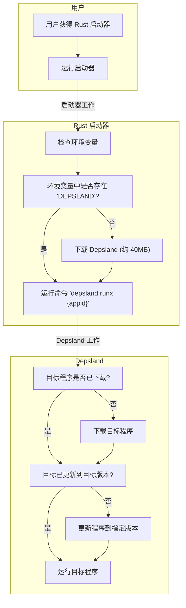

# 关于 Rust 启动器的构想

## 要解决的问题

Depsland 的体积问题导致了多个方面的不良影响.

用户从下载 - 解压 - 运行 - 升级都体验不佳.

我们在构想一个基于 Rust 语言编写的启动器, 来这样解决问题:

- 下载: rust launcher 将采用极为迷你的体积, 无论是聊天, 邮件, 网盘等任何传输形式都可以分发.
- 解压: rust launcher 双击启动, 无需解压.
- 运行: *这个问题没有解决.*
- 升级: rust launcher 将会调用 depsland 的增量更新形式. 与之前的区别是, 之前用户需要手动完成这一步, 尽管难度不高, 但告诉用户怎么做 (特别是出现报错时该怎么做) 仍然是困难的事, rust launcher 则全程自动化完成, 它可以做到 "无感升级".

## 工作流程概述

