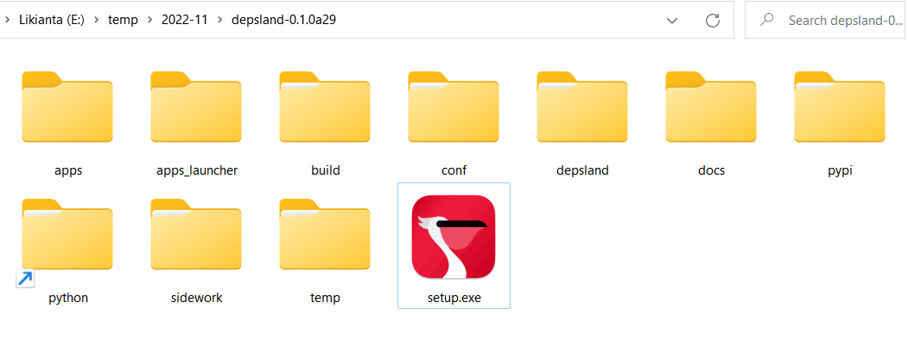
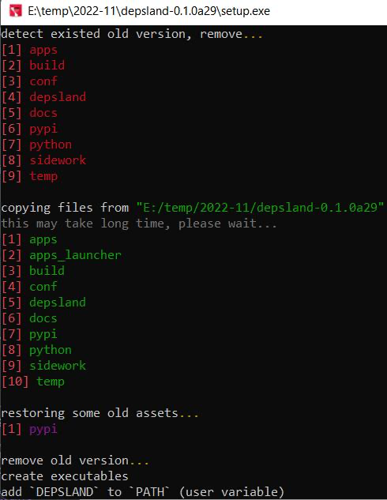
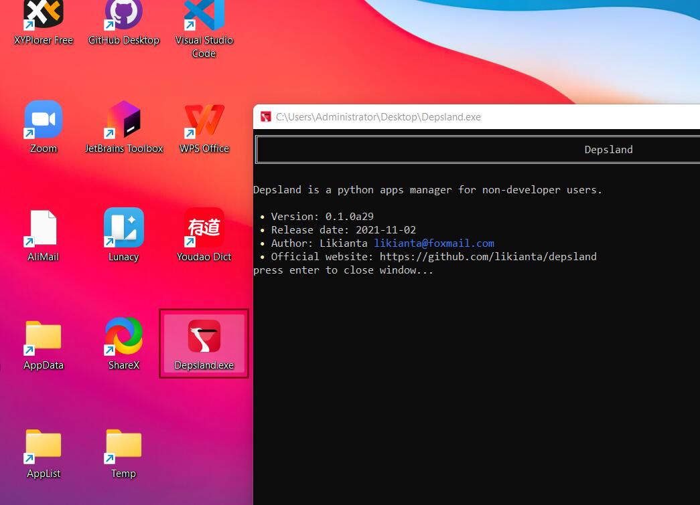

# 如何安装 Depsland

> 当前版本: 0.1.0b0
>
> 发布日期: 2022-11-02

1. 下载安装包

    下载地址:

    - 上海局域网下载: ...
    - 阿里云存储下载: ...
    - jlsemi nas 网盘下载: ...

    下载得到的是一个 ".zip" 文件, 体积约 55mb.

2. 解压后, 双击根目录下的 "setup.exe" 完成安装

    解压后截图:

    

    安装过程截图:

    

    安装完成后, 它将产生以下内容:

    1. 在 `C:\ProgramData` 目录下新增 "Depsland" 目录

    2. 在用户环境变量中新增 "DEPSLAND" 变量

    3. 在桌面创建 "Depsland.exe" 启动器

        

## 通过 Depsland 安装第三方应用程序

1. 由发布者交给用户一个安装器

    一般来说这是一个 exe 文件, 体积在 1kb ~ 100kb 之间.

2. 用户双击安装

    注意首次安装可能需要联网下载资源, 会耗费较长时间.

    后续安装和升级过程会快很多.

3. 安装完成, 在桌面上会生成对应的 exe 启动器, 双击即可启动