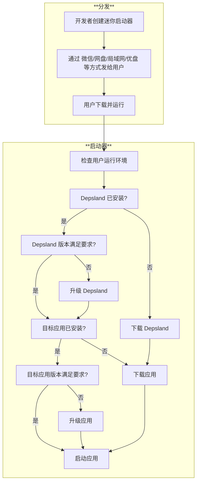

# 迷你启动器

## 为什么要有迷你启动器?

Depsland 的自身安装包体积在 70MB 以上, 如果考虑到以 "shipboard" 模式封装的第三方应用, 其体积可能高达百兆, 这对于多数人来说是一个可感知的体积, 无论是下载, 分发, 解压和拷贝, 对于硬件资源较差的电脑都是不友好的.

为了减轻由于初始的体积给人造成的不好的印象, 我们制作了迷你启动器.

迷你启动器的体积在 5MB 左右, 它在启动时会优先检测并复用本地已有的资源, 仅下载缺少的组件 (注意这需要联网), 从而减轻网络下载压力, 这对于想要初次使用/想要尝鲜的新用户来说, 能一定程度减少焦虑感.

## 工作原理

