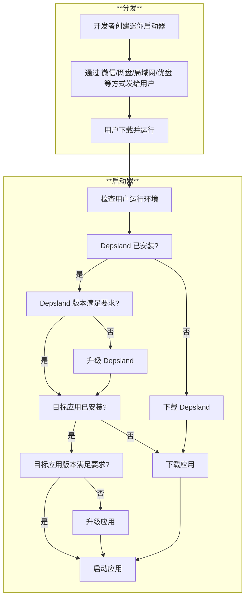

# 迷你启动器

## 为什么要有迷你启动器?

Depsland 的自身安装包体积在 70MB 以上, 如果考虑到以 "shipboard" 模式封装的第三方应用, 其体积可能高达百兆, 这对于多数人来说是一个可感知的体积, 无论是下载, 分发, 解压和拷贝, 对于硬件资源较差的电脑都是不友好的.

为了减轻由于初始的体积给人造成的不好的印象, 我们制作了迷你启动器.

迷你启动器的体积在 5MB 左右, 它在启动时会优先检测并复用本地已有的资源, 仅下载缺少的组件 (注意这需要联网), 从而减轻网络下载压力, 这对于想要初次使用/想要尝鲜的新用户来说, 能一定程度减少焦虑感.

## 工作原理



## 如何创建迷你启动器

### 更新在线安装器

如果升级了 sidework/mini_launcher/pyproject.toml, 则需要:

```sh
python sidework/mini_launcher/make.py tree_shaking_depsland_online_installer -u
```

> [!NOTE]
>
> 如果更新了 `<tree_shaking_project>/tree_shaking/patches/implicit_import_hooks.yaml` 文件, 建议立刻升级 sidework/mini_launcher/pyproject.toml 里的 tree-shaking 依赖, 以免下次调用上述命令时出现 minideps 意外缺失的问题.

细节备忘: 观察上述命令的控制台输出的末尾几行, 如果看到生成的 zip 的体积有别于 `sidework/mini_launcher/app_launcher.v:download_and_extract_depsland_ol:println` 的描述, 请手动修改后者位置的代码.

### 创建目标应用

命令帮助:

```sh
python sidework/mini_launcher/make.py -h
python sidework/mini_launcher/make.py create_launcher -h
python sidework/mini_launcher/make.py create_launcher_from_profile -h
```

常用命令 + 示例:

```sh
python sidework/mini_launcher/make.py \
    create_launcher_from_profile \
    C:/Likianta/workspace/dev.master.likianta/python-tree-shaking/build/build_app.json \
    -o C:/Likianta/temp/2026-06
```


